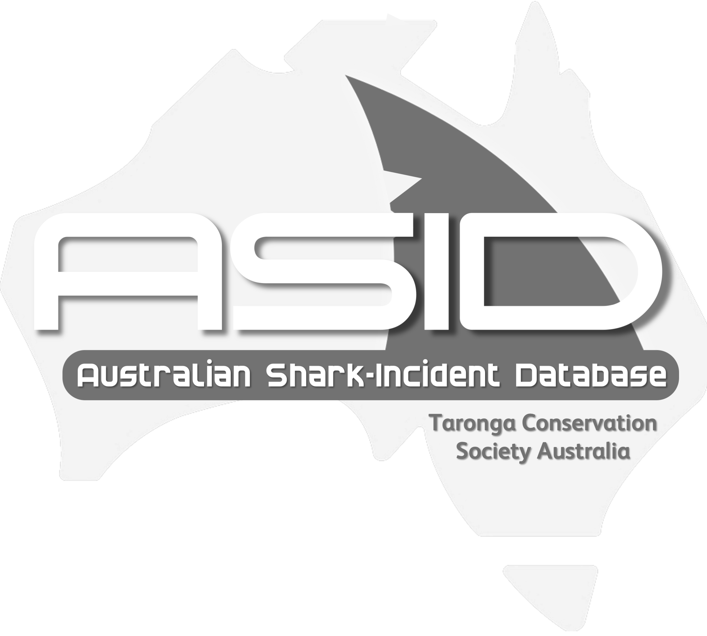
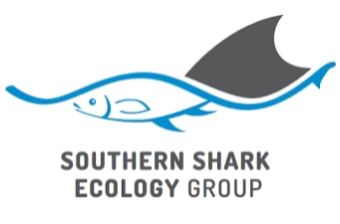

# Shark management strategies power analyses

Analyses to assess power to detect differences in the number of shark bites on humans with/without shark management strategies in place. See also the <a href="https://github.com/cjabradshaw/AustralianSharkIncidentDatabase">Australian Shark-Incident Database</a> (ASID).

 
Prof <a href="https://globalecologyflinders.com/people/#DIRECTOR">Corey J. A. Bradshaw</a>  
<a href="http://globalecologyflinders.com" target="_blank">Global Ecology</a> | <em><a href="https://globalecologyflinders.com/partuyarta-ngadluku-wardli-kuu/" target="_blank">Partuyarta Ngadluku Wardli Kuu</a></em>, <a href="http://flinders.edu.au" target="_blank">Flinders University</a>, Adelaide, Australia  
December 2022  
<a href=mailto:corey.bradshaw@flinders.edu.au>e-mail</a>  
 
contributors: <a href="https://www.flinders.edu.au/people/charlie.huveneers">Charlie Huveneers</a>

## <a href="https://github.com/cjabradshaw/SharkManagementStrategiesPower/tree/main/scripts">Scripts</a>
- <code>SMSpowerAnalysis.R</code>: main R code for analysis
- <code>new_lmer_AIC_tables3.R</code>: source code for information-theoretic algorithms
- <code>r.squared.R</code>: source code for calculating goodness-of-fit for linear models (including mixed-effects models)

## <a href="https://github.com/cjabradshaw/SharkManagementStrategiesPower/tree/main/data">Data</a>
- <em>beachmesh.csv</em>: data of shark bites at beaches with and without beach-mess protection
- <em>sms.csv</em>: data describing shark bites across different beaches before and after shark-management strategies

## Required R packages
- <code>performance</code>
- <code>sjPlot</code>
- <code>lme4</code>

